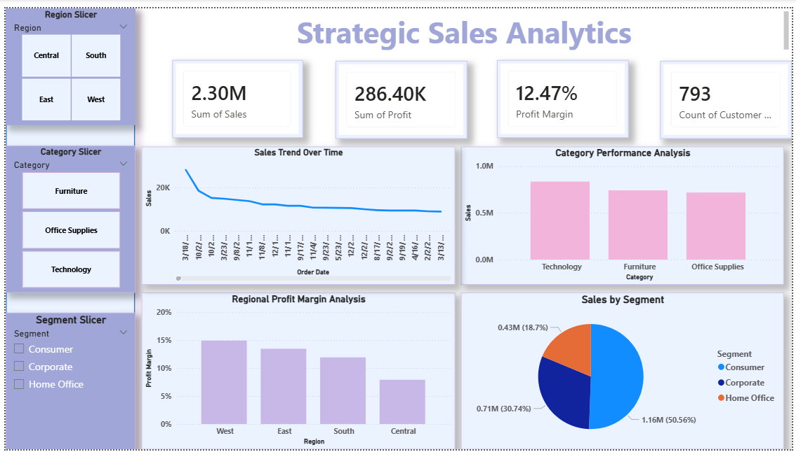
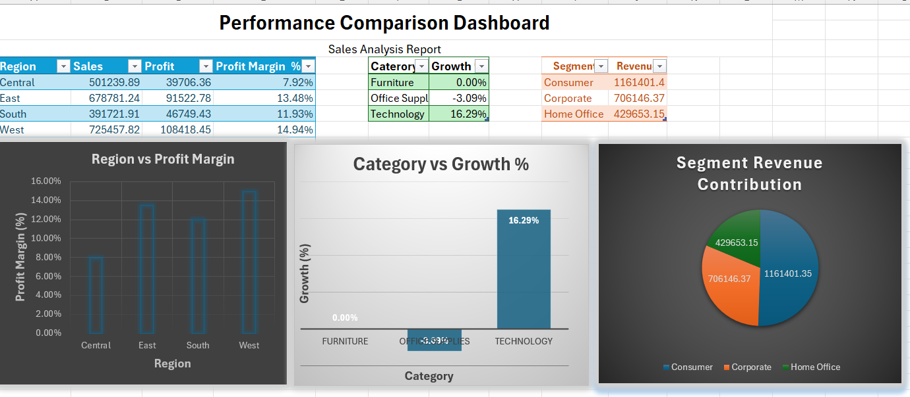
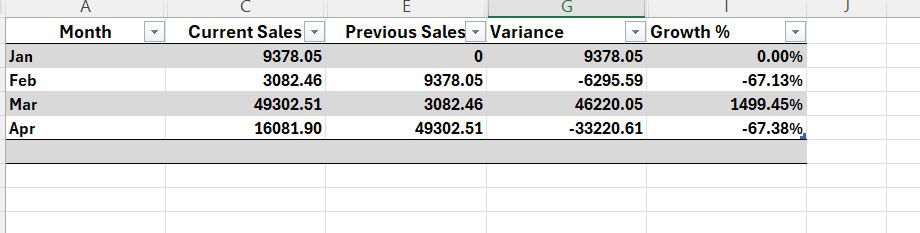
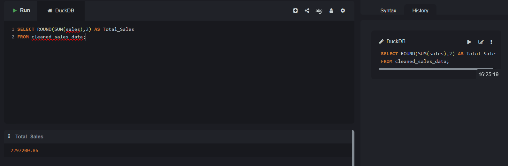
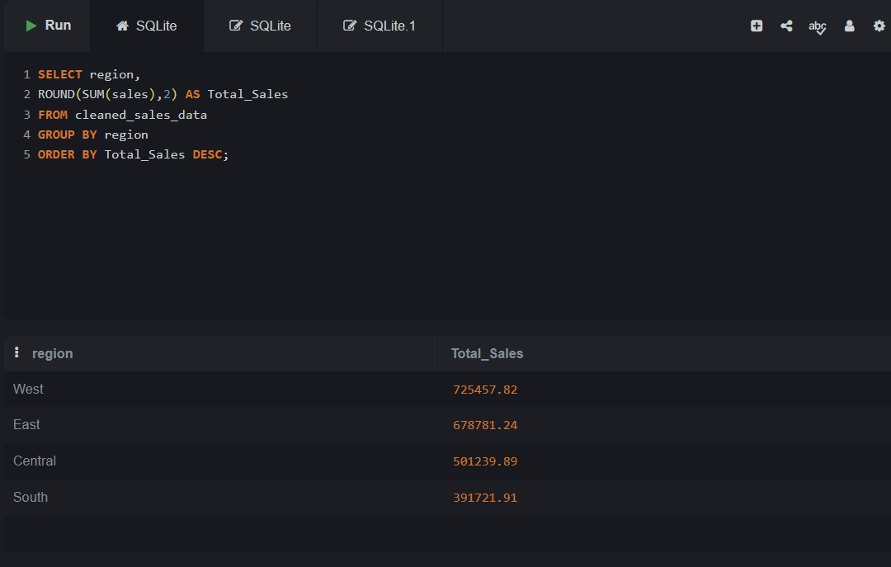
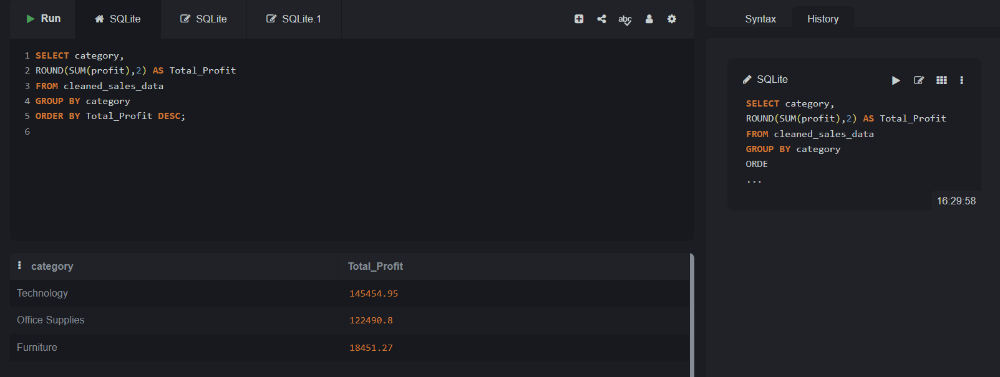
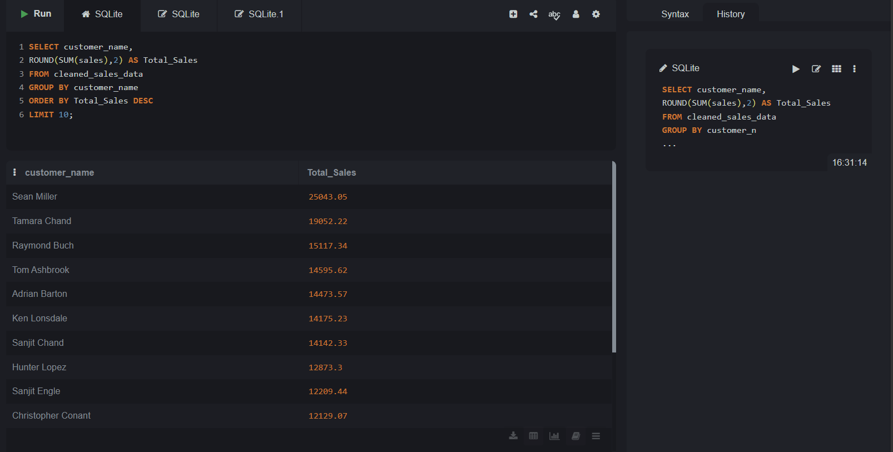
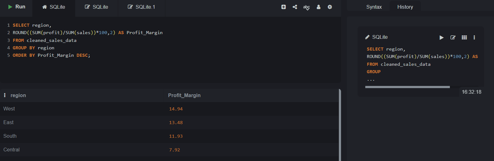

# 📊 Strategic Sales Analytics

## 🚀 Project Overview

Strategic Sales Analytics is a data-driven business intelligence project designed to analyze sales performance, profitability, customer behavior, and regional trends using SQL, Excel, and Power BI.

The project transforms raw sales data into meaningful insights through data analysis, visualization, and interactive dashboards, enabling better business decision-making.

---

# 📈 Power BI Dashboard

> Main Interactive Dashboard

---

# 📊 Excel Dashboard

> Performance Comparison Dashboard

---

# 📉 Variance Analysis Report

> Month-over-Month Sales Growth Analysis

---

## 🎯 Project Objectives

* Analyze overall sales performance
* Identify high-performing regions and categories
* Evaluate profit margins across regions
* Discover top customers by sales contribution
* Track sales trends over time
* Build interactive dashboards for business insights

---

## 🛠️ Tools & Technologies

| Tool            | Purpose                           |
| --------------- | --------------------------------- |
| SQL             | Data Analysis & Querying          |
| Microsoft Excel | KPI Analysis & Reporting          |
| Power BI        | Interactive Dashboard Development |
| CSV Dataset     | Sales Data Source                 |

---

## 📈 Key Business Metrics

* **Total Sales:** 2.30M
* **Total Profit:** 286.40K
* **Profit Margin:** 12.47%
* **Total Customers:** 793

---

## 🗄️ SQL Analysis

The following SQL analyses were performed:

### 1. Total Sales Analysis

### 2. Regional Sales Analysis

### 3. Category Profit Analysis

### 4. Top Customer Analysis

### 5. Profit Margin Analysis

---

## 💡 Business Insights

* Technology category generated the highest profit.
* West region achieved the highest profit margin.
* Consumer segment contributed the largest share of sales.
* Sales performance varied significantly across regions and categories.

---

## 📂 Project Deliverables

* SQL Query Screenshots
* Excel Reports & Dashboards
* Power BI Interactive Dashboard
* Sales Dataset
* Power BI (.pbix) File

---

## 👩‍💻 Author

**Ananya Rawat**
B.Tech CSE (Data Science & AI)

---

### ⭐ If you found this project useful, consider giving it a star!
